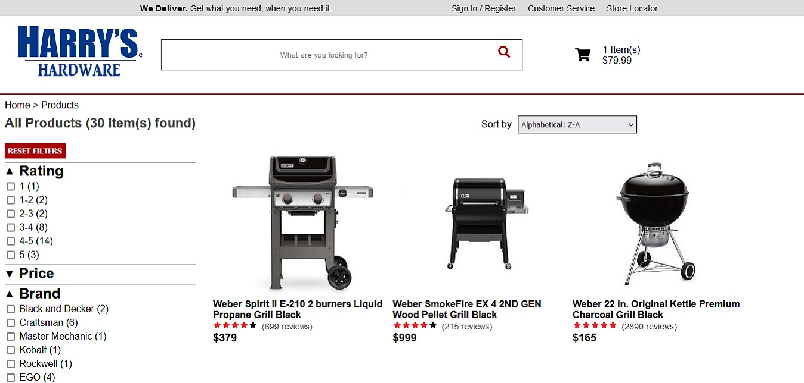
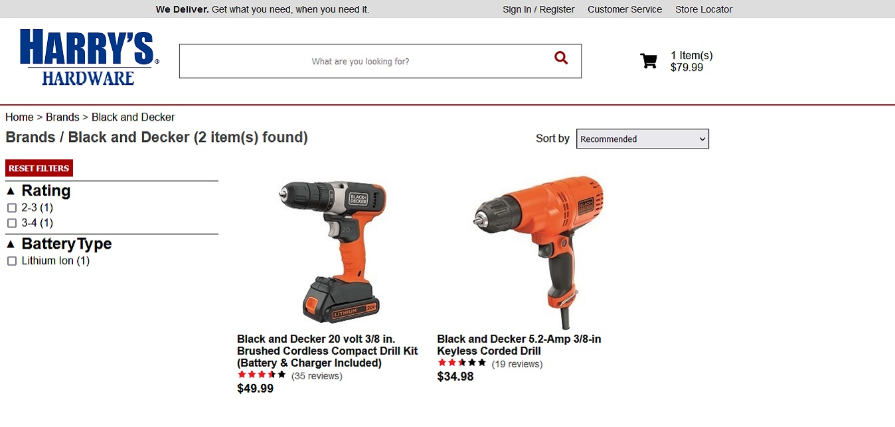
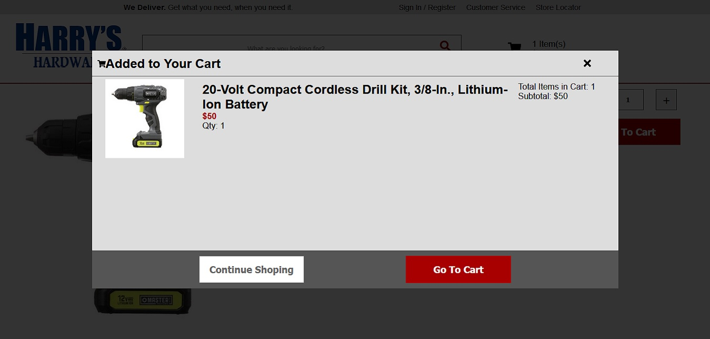
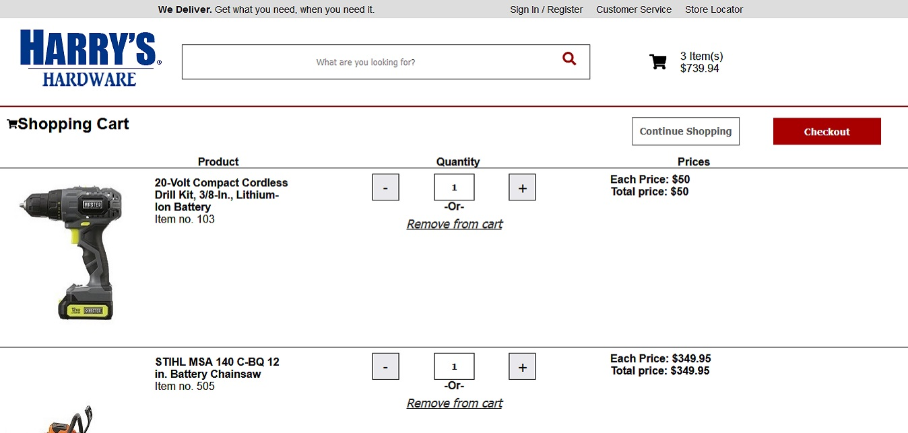

## What is this?
This a portfolio site based on an online hardware store. It was made with React, Redux, Node, Express, TypeScript, and SASS with a few other NPM packages like react-router-dom. You can browse the products on this site by their brand, department, a search query, or view all products as a whole. You can also sort and filter products, as well as purchase products. Products brought are stored in the cart and saved via local storage.

[Click here to try it out](https://hardwaresite.onrender.com)

## IMAGES

  

  

  

  

